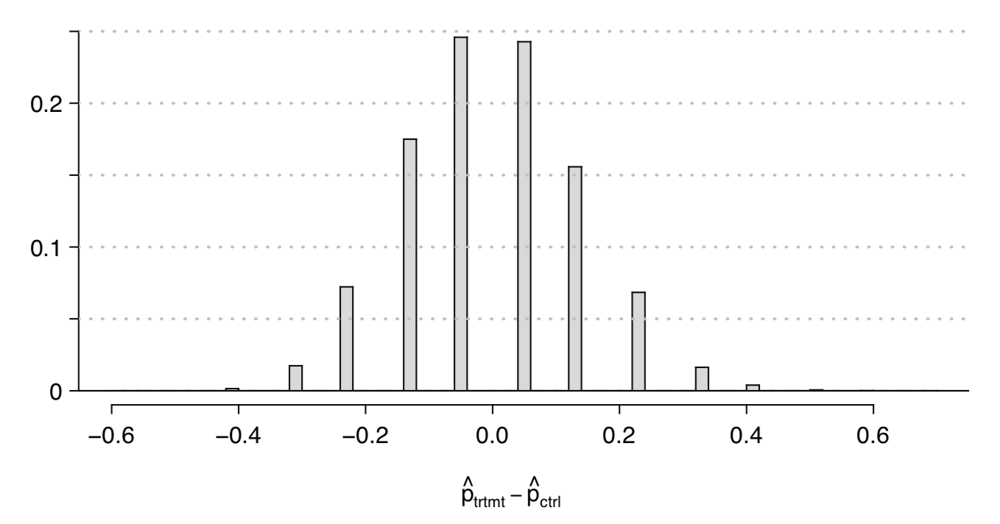

### 2. Is Yawning Contagious?

Note: this problem is adapted from Exercise 2.6 in [Introductory Statistics with Randomization and Simulation](https://www.openintro.org/stat/textbook.php?stat_book=isrs) by David Diez, Christopher Barr, and Mine Cetinkaya-Rundel.

An [experiment conducted by the MythBusters](http://www.discovery.com/tv-shows/mythbusters/mythbusters-database/yawning-contagious/), a science entertainment TV program on the Discovery Channel, tested if a person can be subconsciously influenced into yawning if another person near them yawns. 50 people were randomly assigned to two groups: 34 to a group where a person near them yawned (treatment) and 16 to a group where there wasn’t a person yawning near them (control). The following table shows the results of this experiment.

| &nbsp; | Treatment | Control | Total |
| ------ | --------- | ------- | ----- |
| Yawn   | 10        | 4       | 14    |
| No yawn| 24        | 12      | 36    |
| Total  | 34        | 16      | 50    |

A simulation was conducted to understand the distribution of the test statistic under the assumption of independence: having someone yawn near another person has no influence on if the other person will yawn. In order to conduct the simulation, a researcher wrote yawn on 14 index cards and not yawn on 36 index cards to indicate whether or not a person yawned. Then he shuffled the cards and dealt them into two groups of size 34 and 16 for treatment and control, respectively. He counted how many participants in each simulated group yawned in an apparent response to a nearby yawning person, and calculated the difference between the simulated proportions of yawning in the treatment and control groups. This simulation was repeated 10,000 times using software to obtain 10,000 differences that are due to chance alone. The histogram shows the distribution of the simulated differences.

a) Write code that implements this simulation and produces a similar distribution.

b) Calculate the observed difference between the yawning rates in treatment and control.

c) Estimate the p-value by comparing this observed difference to the distribution from the simulation.

d) Do you have sufficient evidence to reject the null hypothesis that yawning isn't contagious? For the sake of completeness, you can assume that you'd like your long-run error rate to be such that if yawning isn't contagious, your test will falsely identify it as such no more than 1 in 20 times.

e) Now simulate repeating this experiment 1,000 times in a world where yawning is actually contagious, and the true probability of yawning in the treatment and control groups is exactly equal to what was found in this one experiment. Calculate the power for this test by measuring how often your test rejects the null that yawning isn't contagious in these 1,000 experiments.

f) Imagine you were going to produce another episode on this topic for Mythbusters. How would you change the experiment based on the answer to the previous question?